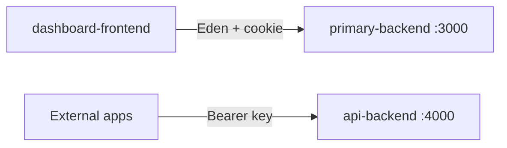

# Dashboard UI (dashboard-frontend)

The **dashboard-frontend** app is the user-facing web interface. It provides a landing page, authentication, API key management, and credit top-ups.

| Property | Value |
|----------|-------|
| **Folder** | `apps/dashboard-frontend/` |
| **npm package name** | `bun-react-template` |
| **Port** | `3001` |
| **Server** | `Bun.serve()` (no Vite) |

## Tech Stack

| Layer | Technology |
|-------|------------|
| UI | React 19 |
| Routing | React Router 7 |
| Styling | Tailwind CSS 4 |
| Components | shadcn/ui (local copies in `src/components/ui/`) |
| Data fetching | TanStack React Query |
| API client | `@elysiajs/eden` treaty typed against `primary-backend` |

## Directory Structure

```
apps/dashboard-frontend/
├── src/
│   ├── index.ts          # Bun.serve entry (:3001)
│   ├── index.html        # HTML shell
│   ├── frontend.tsx      # React mount point
│   ├── App.tsx           # Routes and providers
│   ├── providers/
│   │   └── Eden.tsx      # Typed API client setup
│   ├── pages/
│   │   ├── Landing.tsx
│   │   ├── Signin.tsx
│   │   ├── Signup.tsx
│   │   ├── Dashboard.tsx
│   │   ├── ApiKeys.tsx
│   │   └── Credits.tsx
│   ├── components/
│   │   ├── DashboardLayout.tsx
│   │   └── ui/           # shadcn components
│   └── lib/utils.ts
├── styles/globals.css
└── build.ts              # Production bundler
```

## Routes

| Path | Page | Backend Calls |
|------|------|---------------|
| `/` | Landing | `models.get()` — displays available models |
| `/signup` | Signup | `auth.sign-up.post()` |
| `/signin` | Signin | `auth.sign-in.post()` |
| `/dashboard` | Dashboard | `api-keys.get()`, `models.get()` |
| `/api-keys` | ApiKeys | CRUD on `/api-keys` |
| `/credits` | Credits | `auth.profile.get()`, `payments.onramp.post()` |

## API Client

The Eden provider configures a type-safe client pointing at `primary-backend`:

```ts
// src/providers/Eden.tsx
const client = treaty<App>('http://localhost:3000', {
  fetch: { credentials: 'include' }
})
```

All authenticated requests include the JWT cookie automatically via `credentials: 'include'`.

## Backend Relationship

The dashboard communicates **only** with `primary-backend` at `localhost:3000`. It does not call `api-backend` directly. End users consume the LLM proxy from external applications using their API keys.



## Running Locally

```bash
cd apps/dashboard-frontend
bun run dev
```

Development mode enables HMR via Bun's built-in hot reload.

## Production Build

```bash
cd apps/dashboard-frontend
bun run build
```

Uses `build.ts` to bundle the app with Bun's native bundler.

## Environment Variables

| Variable | Purpose |
|----------|---------|
| `NODE_ENV` | `development` enables HMR; `production` serves static bundle |

## Known Limitations

- Dashboard routes are not protected client-side — unauthenticated users can navigate to `/dashboard` without being redirected
- Sign-out navigates to `/signin` but does not clear the JWT cookie server-side
