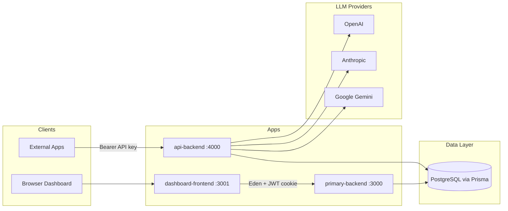

# System Architecture

## High-Level Diagram



## App Responsibilities

### dashboard-frontend (port 3001)

The user-facing web UI. Handles landing page, authentication forms, API key management, and credit top-ups. Communicates **only** with `primary-backend` — it never calls the LLM proxy directly.

### primary-backend (port 3000)

The management API. Handles user registration, login, JWT sessions, API key CRUD, model catalog queries, and mock credit onramp. Exports a typed Elysia `App` used by the frontend Eden client.

### api-backend (port 4000)

The inference proxy. Accepts OpenAI-style chat completion requests, validates API keys, checks user credits, routes to an LLM provider, deducts credits, and returns a normalized response.

## Data Flow: Dashboard Action

```
User → dashboard-frontend → Eden treaty → primary-backend → Prisma → PostgreSQL
```

Authentication uses an httpOnly `auth` cookie set by `primary-backend` on sign-in. The Eden client sends requests with `credentials: 'include'`.

## Data Flow: Chat Completion

```
External client
  → POST /api/v1/chat/completions (Bearer sk-or-v1-...)
  → api-backend validates key + credits
  → Lookup model slug in DB
  → Pick random provider from ModelProviderMapping
  → Call OpenAI / Claude / Gemini SDK
  → Compute credit cost from token counts
  → Decrement user credits, increment apiKey.creditsConsumed
  → Return LlmResponse
```

## Shared Package: db

Both backends import the `db` workspace package, which exports a singleton Prisma client connected to PostgreSQL. This ensures a single schema and consistent data access across services.

## Model Slug Format

Chat requests use a model slug in the format:

```
company/provider-model
```

Example: `anthropic/claude-sonnet-4`

The slug is split to find the model in the database. A random provider mapping is selected from available providers for that model.

## Credit Calculation

Credits are computed as:

```
(inputTokens × inputTokenCost + outputTokens × outputTokenCost) / 10
```

Pricing comes from the `ModelProviderMapping` table, which stores per-provider input and output token costs.

## Authentication Models

| Service | Method | Details |
|---------|--------|---------|
| primary-backend | JWT in httpOnly cookie | 7-day expiry, signed with `JWT_SECRET` |
| api-backend | Bearer token | API key validated against `ApiKey` table |

These are separate auth paths — dashboard users authenticate with cookies; external API consumers use API keys.

## Monorepo Tooling

- **Turborepo** orchestrates `dev`, `build`, `lint`, and `check-types` across workspaces
- **Bun workspaces** link `apps/*` and `packages/*`
- Root scripts: `bun run dev` starts all apps in parallel via Turbo

## Template Packages (Unused)

The repo includes Turborepo starter packages that are not used by the main apps:

- `@repo/ui` — stub React components
- `@repo/eslint-config` — shared ESLint configs
- `@repo/typescript-config` — shared tsconfig presets

The dashboard uses its own local shadcn/ui components instead of `@repo/ui`.
