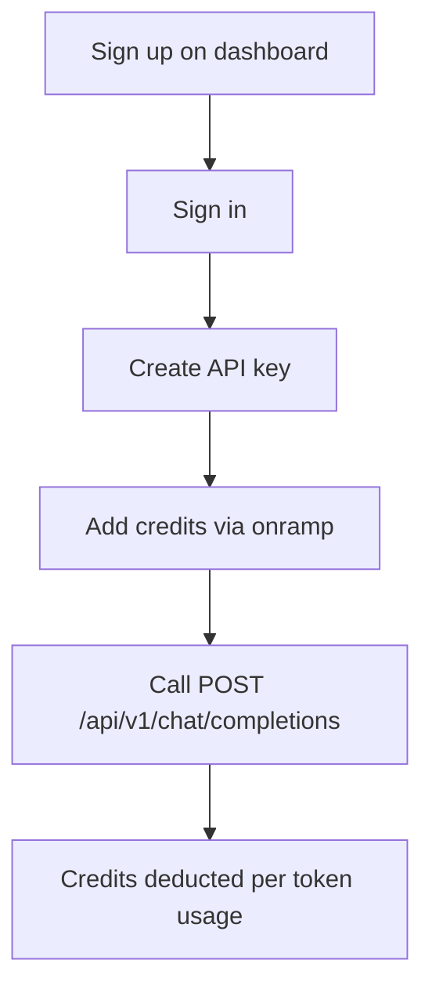

# Project Overview

## What Is This Project?

**OpenRouter** is a monorepo that implements an LLM gateway similar to [OpenRouter](https://openrouter.ai). It lets developers:

1. Create an account and manage API keys from a web dashboard
2. Purchase or receive credits for usage
3. Send chat completion requests to multiple LLM providers through a single API

The project is built as a **Turborepo** with **Bun** workspaces, written entirely in **TypeScript**.

## Repository Structure

```
openrouter/
├── apps/
│   ├── primary-backend/     # User management API (port 3000)
│   ├── api-backend/         # LLM proxy API (port 4000)
│   └── dashboard-frontend/  # React dashboard (port 3001)
├── packages/
│   └── db/                  # Shared Prisma client + PostgreSQL schema
├── docs/                    # Project documentation
├── package.json
└── turbo.json
```

## Key Features

| Feature | Description |
|---------|-------------|
| **Multi-provider routing** | Routes requests to OpenAI, Anthropic Claude, or Google Gemini based on model slug |
| **Credit-based billing** | Deducts credits per token using provider-specific pricing from the database |
| **API key management** | Create, enable/disable, and delete `sk-or-v1-*` style keys |
| **User authentication** | Email/password signup with JWT stored in an httpOnly cookie |
| **Model catalog** | Companies, models, and provider mappings stored in PostgreSQL |
| **Type-safe frontend** | Eden treaty client typed against the Elysia backend app |

## User Journey



1. **Sign up / sign in** on the dashboard at `localhost:3001`
2. **Create an API key** from the API Keys page
3. **Add credits** via the mock onramp (+1,000 credits per transaction)
4. **Use the API key** as a Bearer token against `api-backend` at `localhost:4000`
5. **Credits are deducted** automatically based on input/output token counts

## Tech Stack Summary

| Layer | Technology |
|-------|------------|
| Runtime | Bun 1.3.3 |
| Monorepo | Turborepo |
| Backend framework | Elysia |
| Database | PostgreSQL + Prisma 7 |
| Frontend | React 19, React Router 7, Tailwind CSS 4, shadcn/ui |
| API client | `@elysiajs/eden` (Eden treaty) |
| LLM SDKs | OpenAI, Anthropic, Google GenAI |

## Work In Progress

Some features exist in schema or code but are not fully wired up:

- `Conversation` logging is defined in the database but not written during chat
- Payment onramp is a mock DB increment (no real payment provider)
- No seed script for models/providers — catalog data must be inserted manually
- Dashboard routes are not protected client-side (no redirect when unauthenticated)

See [SYSTEM-ARCHITECTURE.md](../architecture/SYSTEM-ARCHITECTURE.md) for how the pieces connect.
